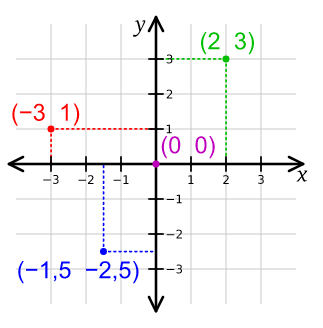

# Spickzettel

Beim Programmieren schreibt man Text, und gibt dem Computer Befehle.

## Starte hier

```python
import arcade

# Öffne ein weißes Fenster
arcade.open_window(600, 600, "Arcade")
arcade.set_background_color(arcade.color.WHITE)

arcade.start_render()

# Hier kannst du zeichnen

arcade.finish_render()

# Startet das Programm
arcade.run()
```

## Zeichenbefehle

### Linie

```python
import arcade

arcade.draw_line(0, 0, 50, 50, arcade.color.YELLOW)
```

### Rechteck

```python
import arcade

# Gefüllt
arcade.draw_xywh_rectangle_filled(150, 100, 100, 50, arcade.color.YELLOW)

# Nur außen
arcade.draw_xywh_rectangle_outline(150, 100, 100, 50, arcade.color.YELLOW)


```

### Kreis

```python
import arcade

# Gefüllt
arcade.draw_circle_filled(50, 100, 10, arcade.color.YELLOW)

# Nicht gefüllt
arcade.draw_circle_filled(50, 100, 10, arcade.color.YELLOW)
```

## Farben

| Farbe      | Code                  |
| -------    | -------------------   |
| gelb       | arcade.color.YELLOW   |
| rot        | arcade.color.RED      |
| grün       | arcade.color.GREEN    |
| blau       | arcade.color.BLUE     |
| himmelblau | arcade.color.SKY_BLUE |
| weiß       | arcade.color.WHITE    |
| schwarz    | arcade.color.BLACK    |

[Noch mehr Farben](http://arcade-gui.s3-website.eu-central-1.amazonaws.com/arcade.color.html)

### Beispiel - Zufällige Farbe

```python
import arcade
from random import choice

farben = [
    arcade.color.YELLOW,
    arcade.color.RED,
    arcade.color.GREEN,
    arcade.color.BLUE,
    arcade.color.WHITE,
    arcade.color.BLACK
]

arcade.draw_circle_filled(50, 100, 10, choice(farben))
```

## Koordinaten System

Um einen Punkt auf dem Bildschirm anzugeben müsst ihr zwei Zahlen angeben X und Y.

X - Gibt an wie weit von links nach rechts Y - Gibt an wie viel von unten nach oben



