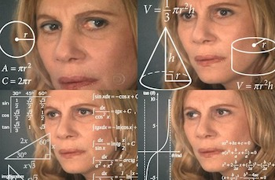

# For Schleife

Beim Programmieren möchte man häufig dinge mehrfach tun. 
Zum Beipiel brauchen wir für einen Wald, viel mehr Bäume.

Schauen wir uns dieses Beispiel einmal an:

```python
for x in range(5):
    print(x)
```

Dieser Code würde entsprechend `print()` fünf mal ausführen, 
und dabei ändert sich jedes mal die x Variable. (0, 1, 2, 3, 4)

Doch warum fangen wir eigentlich bei 0 an?



> In der Programmierung fängt man häufig bei 0 an zu zählen.
> Das ist am Anfang verwirrend, aber dafür gibt es einen tollen Spruch:
>
>   ```markdown
>   Es gibt zwei schwierige Dinge beim Programmieren:
>   1. Alte Informationen
>   2. den richtigen Namen zu finden,
>   3. und verzählt-um-eins Fehler 
>   ```


> ✅ Aufgabe: Zeichnet mehrere Bäume nebeneinander, aber benutzt nur einmal eure `baum(x,y)` Funktion