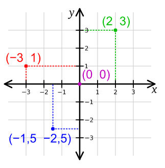

# Spickzettel

Beim Programmieren schreibt man Text, und gibt dem Computer Befehle.

## Das Koordinaten System

Um einen Punkt auf dem Bildschirm anzugeben müsst ihr zwei Zahlen angeben X und Y.

X - Gibt an wie weit von links nach rechts  
Y - Gibt an wie viel von unten nach oben



## Mit diesem Code kannst du starten

```python
import arcade

# Öffne ein Fenster
width = arcade.get_screens()[0].width
height = arcade.get_screens()[0].height
window = arcade.open_window(width, height, "Arcade")
window.set_mouse_visible(False)
arcade.set_background_color(arcade.color.CHROME_YELLOW)

# So erstellt man eine Figur
figur = arcade.Sprite(arcade.resources.image_alien_blue_front)

# So kann man eine Figur positionieren
figur.center_x = 100
figur.center_y = 100

# Hier zeichnen wir
def draw():
    # Dies sagt dem Computer, dass er anfangen soll zu zeichnen
    arcade.start_render()
    
    # Hier kann man noch mehr zeichnen, zum Beispiel einen Wald
    figur.draw()
    
    # Dies sagt dem Computer, dass du mit Zeichnen fertig bist
    arcade.finish_render()

# Dies wird aufgerufen, wenn die Maus bewegt wird
@window.event("on_mouse_motion")
def wenn_maus_bewegt(x, y, dx, dy):
    # Hier setzen wir die Figur dahin wo die Maus gerade ist
    figur.center_x = x
    figur.center_y = y
    
    # Neuzeichnen nicht vergessen
    draw()
    
draw()
arcade.run()

```

## Zeichenbefehle

```python
import arcade

# Linie
arcade.draw_line(0, 0, 50, 50, arcade.color.YELLOW)

# Rechteck
arcade.draw_xywh_rectangle_filled(150, 100, 100, 50, arcade.color.YELLOW)
arcade.draw_xywh_rectangle_outline(150, 100, 100, 50, arcade.color.YELLOW)

# Kreis
arcade.draw_circle_filled(50, 100, 10, arcade.color.YELLOW)
arcade.draw_circle_outline(50, 100, 10, arcade.color.YELLOW)

# Text
punkte = 10
arcade.draw_text(f"Du hast {punkte} Punkte", 50, 100, arcade.color.COOL_GREY)
```

## Farben

| Farbe      | Code                  |
| -------    | -------------------   |
| gelb       | arcade.color.YELLOW   |
| rot        | arcade.color.RED      |
| grün       | arcade.color.GREEN    |
| blau       | arcade.color.BLUE     |
| himmelblau | arcade.color.SKY_BLUE |
| weiß       | arcade.color.WHITE    |
| schwarz    | arcade.color.BLACK    |

[Noch mehr Farben](http://arcade-gui.s3-website.eu-central-1.amazonaws.com/arcade.color.html)


## Funktionen

```python
# Eine Funktion fängt an mit 'def', einem Namen und den Klammern
def baum(x, y):  # In den Klammern könnt ihr angeben, welche informationen ihr braucht 
    # alle Befehle, die ausgeführt werden sollen, müssen eingerückt werden:
    arcade.draw_xywh_rectangle_filled(x, y, 20, 60, arcade.csscolor.SIENNA)
    arcade.draw_triangle_filled(x - 20, y + 30, x + 10, y + 110, x + 40, y + 30, arcade.csscolor.DARK_GREEN)
    arcade.draw_circle_filled(x, y, 3, arcade.color.RED)


baum(290, 190)
```

### Eine Zeichenfunktion

Um auch das Zeichnen wieder verwenden zu können, lohnt es sich, die Befehle in eine eigene Funktion zu tun.

```python
def draw():
    arcade.start_render()
    # Hier kannst du nun zeichnen
    arcade.finish_render()
```

## For-Schleifen

Um Befehle mehrfach auszuführen, kann man eine Schleife benutzen,
dies ist Code, der wieder von vorne anfängt, 
wenn er das ende erreicht, wie eine Schleife.

```python
for x in range(10):
    # Dies zeichnet 10 Bäume, im Abstand von 50 Pixel
    baum(x * 50, 190)
```

## Erstelle eine Figur
```python
import arcade

alien = arcade.Sprite(arcade.resources.image_alien_blue_front)
biene = arcade.Sprite(arcade.resources.image_bee)
abenteuerin = arcade.Sprite(arcade.resources.image_female_adventurer_idle)
abenteuer = arcade.Sprite(arcade.resources.image_male_adventurer_idle)
roboter = arcade.Sprite(arcade.resources.image_robot_idle)

# Hiermit kann man eine Figur auf dem Bildschirm positionieren
alien.center_x = 100
alien.center_y = 200

# Man kann Figuren auch kleiner machen
alien.scale = 0.5 # halb so groß
alien.scale = 0.25 # viertel so groß

# Hiermit kann man eine Figur zeichnen
alien.draw()
```

Natürlich gibt es noch viel mehr Figuren, die du benutzen kannst, schau doch mal hier:
[Übersicht](http://arcade-gui.s3-website.eu-central-1.amazonaws.com/resources.html)


## Viele Sterne / Listen

```python
# Dies erstellt eine neue Liste für Münzen
import arcade

sterne = arcade.SpriteList()

# Erstelle einen Stern
stern = arcade.Sprite(arcade.resources.image_star)
stern.center_x = 100
stern.center_y = 400

# Füge den Stern einer Liste hinzu
sterne.append(stern)


def draw():
    arcade.start_render()
    # Dies zeichnet alle Sterne aus der Liste
    sterne.draw()
    arcade.finish_render()
```

### Entferne einen Stern

```python
# Dies entfernt einen Stern aus allen Listen
stern.remove_from_sprite_lists()
```

### Zusammenstoßen mit einem Stern

In Spielen möchte man oft schauen, ob die Spielfigur etwas berührt.
Dafür kann man folgendes benutzen:

```python
import arcade

# Die Spielfigur
alien = arcade.Sprite(arcade.resources.image_alien_blue_front, scale=0.8)
alien.center_x = 100
alien.center_y = 200

# Die Liste mit Sternen
sterne = arcade.SpriteList()

# Der erste Stern
stern = arcade.Sprite(arcade.resources.image_star)
stern.center_x = 100
stern.center_y = 200
sterne.append(stern)

# Nun können wir schauen ob das Alien einen Stern berührt
beruehrte_sterne = alien.collides_with_list(sterne)
for stern in beruehrte_sterne:
    # Die nächsten Befehle werden für jeden berührten Stern ausgeführt 
    # Man kann den Stern dann zum Beispiel entfernen
    stern.remove_from_sprite_lists()
```

## Auf die Maus reagieren

### Maus bewegungen
```python
@window.event("on_mouse_motion")
def wenn_maus_bewegt(x, y, dx, dy):
    print(f"Die Maus ist bei {x}, {y}") 
```

### Maus dücken
```python
@window.event("on_mouse_press")
def wenn_maus_druecken(x, y, button, modifier):
    print(f"Du hast die Maus gedrückt bei {x}, {y}") 
```

### Maus loslassen
```python
@window.event("on_mouse_release")
def wenn_maus_loslassen(x, y, button, modifier):
    print(f"Du hast die Maus losgelassen bei {x}, {y}")
```

## Auf Tasten reagieren

### Taste drücken
```python
@window.event("on_key_press")
def wenn_taste_gedrueckt(symbol, modifier):
    print(f"Du hast eine Taste gedrueckt")
```


